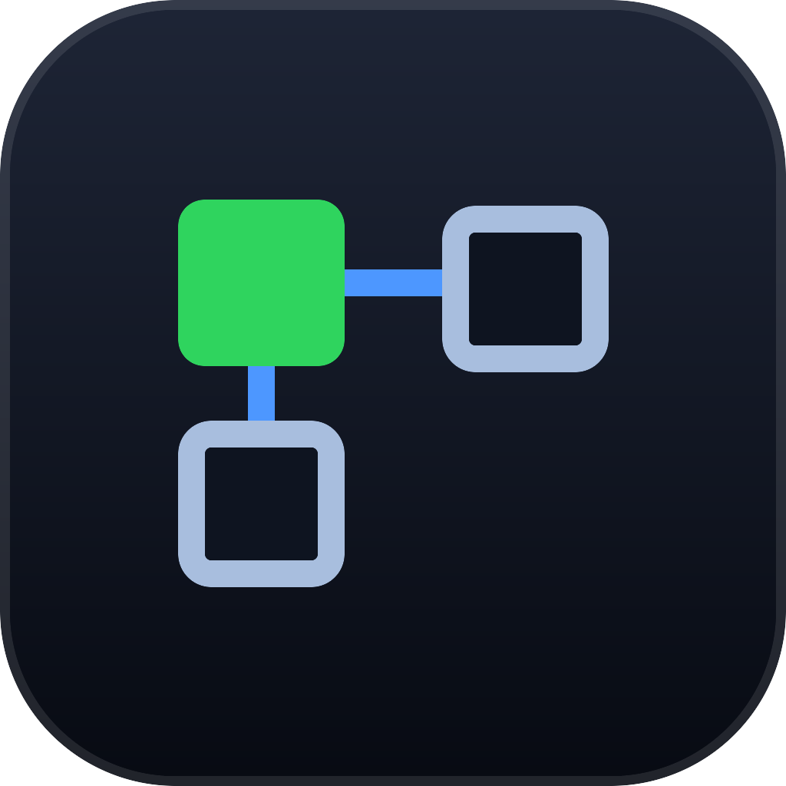

<p align="center">
  
</p>

# Agent Canvas

[](https://github.com/prayagtushar/agent-canvas/actions/workflows/ci.yml)
[](LICENSE)
[](https://tauri.app)

Run several AI coding CLIs at once on one canvas, and let them hand work to each
other.

Each agent is a real child process with its own harness, account, and working
directory, running in a real terminal. What you see in a node is the CLI's own
interface, not a transcript of it — you can answer its permission prompts, run
its slash commands and cycle its modes, from the canvas. You draw the
connections that decide who can see whom. The window is transparent, so your
desktop wallpaper shows through behind the work.

## What it does

Every agent is a terminal window you can move, resize, and wire to another one.
Underneath sits a local coordination server, the Bus, that agents reach as a
real MCP server.

- Start a **team** in one click: several agents, each with a role, already wired
  to each other. A review pair, a plan/build/verify line, or one you saved off
  your own canvas.
- Type into any node and you are typing into the CLI. It is a pty, so arrow
  keys, Escape and shift+tab all arrive.
- An agent sees only the peers you connected it to. No edge, no visibility.
- Peers see each other's **roles**, so an agent routes work to whoever it
  belongs to instead of doing it itself.
- An agent can **hire another agent**: an orchestrator plans the work, staffs
  it, and watches it happen. Capped at 8 agents, and you hold the switch.
- Every agent is told where it is, so it knows to ask a peer instead of
  guessing when a question is about work it did not do.
- Everything the agents say to each other is kept in the Traffic panel. Their
  own copy is typed into a full-screen TUI and scrolls away; this one does not.
- The command bar names the agent it is about to send to, and Everyone sends to
  all of them at once.
- Agents create, claim, and finish tasks on a shared board. A claim is
  exclusive, so two agents cannot pick up the same task.
- Agents read and write one shared memory instead of each keeping its own.
- An agent can stop and ask you a question. It blocks until you answer.
- Each agent can get its own git worktree, so concurrent edits never collide.
- Export the session as a Markdown **report**: who was on the canvas, what they
  said to each other, which tasks got finished, and each agent's transcript.
- Desktop notifications when an agent needs a decision or the work is done, so
  you can leave the window.
- A **Diagnostics** sheet answers "why won't this CLI run": what is installed,
  which version, and how the Bus reaches each one.

## How it works

```
┌──────────────────────────── Tauri 2 app ────────────────────────────┐
│  React frontend                │  Rust backend                      │
│  ├─ Canvas (xyflow)            │  ├─ axum HTTP server (the Bus)     │
│  ├─ terminal per node (xterm)  │  ├─ one pty per agent              │
│  ├─ zustand store              │  ├─ MCP-over-stdio endpoint        │
│  └─ workspace persistence      │  └─ git worktree management        │
└─────────────────────────────────────────────────────────────────────┘
                                   ▲
                    same binary invoked as: --bus-mcp PORT TOKEN NODE_ID
                                   │
        claude --mcp-config <generated>   ← on a pty, through your shell
```

When the app spawns an agent, it writes an MCP config pointing at its own
executable in `--bus-mcp` mode. That subprocess talks JSON-RPC over stdio with
the agent and forwards tool calls to the Bus over HTTP. Agents call real MCP
tools. Nothing wraps the prompt and nothing scrapes output.

Each CLI is started through your login shell, so it finds the same PATH, and
runs interactively for as long as the node is open. A prompt sent from the
canvas is typed into it; one agent messaging another that happens to be idle is
typed in too, so it acts on it straight away.

### What a connection means

Drawing a wire between two agents does two things: it lets them message each
other, and it lets each read what is on the other's screen. That is all it
does. Nothing is pushed across a wire, and neither agent is watching the other.

So an agent finds out what its peer did by asking:

| It wants to know | It calls |
| --- | --- |
| who am I connected to, and what are they doing | `list_peers` |
| what exactly did that peer do | `get_peer_context` |
| has anyone written this down for everyone | `recall` |

The rule is that the shape of the canvas is public and content needs a wire.
Any agent can see that another node exists, its name and whether it is busy, so
it can ask you to connect them. Reading what a node is actually doing takes a
wire.

Because nothing is pushed, anything one agent works out stays on its own node
until it calls `remember`. If you want a decision to outlive a turn, tell the
agent to remember it — or read it off their screen from a connected peer.

### Tools an agent gets

| Group | Tools |
| --- | --- |
| Discovery | `list_peers`, `get_peer_context`, `list_canvas` |
| Messaging | `message_peer`, `check_inbox` |
| Tasks | `add_task`, `list_tasks`, `claim_task`, `complete_task` |
| Memory | `remember`, `recall`, `forget` |
| Dependencies | `get_node_status`, `wait_for_nodes` |
| Escalation | `ask_user` |

Every agent is handed a short briefing when its Bus connection opens: which
node it is, that its peers' terminals are invisible to it, that nothing it
prints reaches anyone else, and that an unfamiliar name is more likely to be a
peer's work than a mistake — so look before answering that something does not
exist. It arrives through MCP's own `instructions` field, so every harness gets
it without a per-CLI hack.

## Harnesses

"Bus" means the CLI can be wired to the tools above. The others still run on the
canvas as terminals. Anything missing from your `PATH` shows greyed out in the
launcher.

| CLI | Bus | Run against it |
| --- | --- | --- |
| `claude` (Claude Code) | yes | yes |
| `opencode` | yes | yes |
| `codex` (Codex) | yes | not yet |
| `gemini` (Gemini CLI) | yes | not yet |
| `qwen` (Qwen Code) | yes | not yet |
| `crush` | yes | not yet |
| `goose`, `aider`, `amp`, `cursor-agent`, `copilot`, `droid` | no | not yet |

Adding one takes a row in `HARNESSES` and a match arm in `start_process`, both
in [`src-tauri/src/spawn.rs`](src-tauri/src/spawn.rs).

## Installing

Download the build for your machine from
[Releases](https://github.com/prayagtushar/agent-canvas/releases):

| Machine | File |
| --- | --- |
| macOS, any Mac since 2020 or earlier | `Agent.Canvas_*_universal.dmg` |
| Windows 10 or 11, 64-bit | `Agent.Canvas_*_x64-setup.exe` or the `.msi` |

Agent Canvas runs the agent CLIs you already have. It does not ship or download
any of them — install at least one of Claude Code, Codex, Gemini CLI or
opencode first, and sign in to it once in your terminal.

### The first-run warning

These builds are not code-signed, because a signing certificate costs money
every year and this is a hobby project. Both systems will say so, and both let
you through:

**macOS** — "Agent Canvas is damaged and can't be opened" or "cannot be opened
because the developer cannot be verified". Right-click the app in Applications
and choose **Open**, then **Open** again in the dialog. If macOS refuses
outright, clear the download quarantine flag:

```sh
xattr -dr com.apple.quarantine "/Applications/Agent Canvas.app"
```

**Windows** — SmartScreen shows "Windows protected your PC". Click **More
info**, then **Run anyway**.

Building it yourself avoids both warnings entirely, and is two commands.

## Running it from source

You need Node 18 or newer, a Rust toolchain, and at least one agent CLI on your
`PATH`.

```sh
npm install
npm run tauri dev
```

For a bundle you can install:

```sh
npm run tauri build
```

The result lands in `src-tauri/target/release/bundle/`.

Pick a working folder from the toolbar, then start a team from the empty
canvas — that gets you two or three agents, each with a role, already connected.
For a single agent, use the `+` in the left rail or type "add a Claude Code
agent" in the bar. To connect two by hand, right-click either one and pick the
other under **Connected to**, or drag between their green dots.

Then send one instruction to **Everyone** and watch it divide.

### Try it on something real

[`examples/`](examples) has three small projects, each with a failing test
suite and the exact prompt to send. They finish when the suite passes, so
whether the agents actually did the work is a question with an answer:

```sh
node examples/verify.mjs
```

Start with `fix-the-tests`. Then run `two-heads` twice — once as written, and
once with the wire between the two agents deleted. The second run fails,
because without a connection neither agent can reach what the other knows.

### Teams

A team is a set of agents, their roles, and the wires between them. Three ship
with the app:

| Team | Who |
| --- | --- |
| Review pair | A Maker writes, a Reviewer reads it and objects |
| Plan, build, verify | A Planner fills the board, a Builder claims from it, a Verifier runs the tests |
| Orchestrator | One lead that hires its own crew and splits the work between them |
| Second opinion | Two different CLIs answer the same question, then compare |

Each member gets an opening brief that sets its role and tells it to wait, so
launching a team spends nothing until you send the first instruction. A role is
stored on the Bus, which means peers read it out of `list_peers` — that is how
an agent knows to hand a review to the Reviewer rather than doing it itself.

Wire up a canvas you like, then **Save this canvas as a team** from the same
menu. Agent processes do not survive a restart; the team does.

### Letting an agent build its own team

An agent with the Bus can call `hire_agent`. The new agent starts in the same
folder, connected to the one that asked for it, with whatever opening brief it
was given. That is how the **Orchestrator** team works: you start one Claude
Code agent, tell it what to build, and it staffs the rest itself.

Guardrails, because this starts real processes and spends real money:

- Off is one click away — Settings, **Start other agents**.
- Eight agents on the canvas at once, however they got there.
- A name already in use, a CLI that is not installed, and a nameless agent are
  all refused before anything is spawned.
- Every hired agent appears on your canvas with a toast saying who started it.

New agents get a call-sign of their own (Orion, Juno, Vega…), so two Claude
agents are never both called "claude". Double-click a name to change it; peers
see the new one too.

### Keyboard

| Key | Action |
| --- | --- |
| `⌘K` | Focus the command bar |
| `↑` / `↓` | Recall a prompt you already sent |
| `⌘1`…`⌘9` | Go to that agent and type in it |
| `⌘[` / `⌘]` | Previous / next agent |
| `⌘0` | Fit everything on screen |
| `⌘J` | Show the Traffic panel |
| Double-click a name | Rename that agent |
| `⌘F` | Find an agent or note; Enter walks the matches |
| `⌘S` | Save the workspace |
| `⌘.` | Interrupt everything running |
| `⌘\` | Toggle focus mode |
| `?` | Show all shortcuts |

## Security

Agents run as you, with your files, your environment, and your credentials.
Claude Code launches with `--permission-mode acceptEdits`, so it writes files in
its working directory without asking. Pick that folder deliberately, and turn on
the per-agent worktree option when several agents share a repository.

Treat agent output as untrusted input. Anything an agent reads, from a file, the
web, or a peer, can steer what it does next.

The Bus binds to `127.0.0.1` on a random port and checks a bearer token on every
route, including `/health`. The token is new on each launch, is written only into
per-agent config files under your cache directory, and never leaves the machine.

Found a vulnerability? Open a [private advisory](https://github.com/prayagtushar/agent-canvas/security/advisories/new)
rather than a public issue.

## Tests

```sh
npm test
```

Runs the frontend suite and then the Rust one.

```sh
npm run examples
```

Runs the three example projects in [`examples/`](examples). All three are red
on a fresh checkout — that is the starting state, and the point.

| Suite | What it covers |
| --- | --- |
| `src/store.test.ts` | window placement, optimistic launch and its rollback, the Bus owning the wire graph, unread counts, distinct agent names, prompt history, the traffic log, panning to a node without changing zoom, launching a team and saving one, the finished-work notification |
| `src/report.test.ts` | the session report: the numbers at the top, names never ids, empty sections that say so, a transcript containing a code fence |
| `src/terminals.test.ts` | output buffered before a node exists, scrollback surviving a remount, keystrokes reaching the right pty |
| `tests/bus_flow.rs` | peer scoping, edge-gated messaging, the message cap, the task lifecycle, human escalation, renames peers can see, board order, work in progress that cannot be deleted |
| `tests/mcp_bridge.rs` | the real MCP bridge over stdio: tool discovery, the briefing, a peer's screen readable only across a wire, blocking waits |
| `tests/pty_session.rs` | real processes on real ptys: output arriving, prompts landing, a swallowed prompt retyped then given up on, a message typed into an idle agent |
| `tests/worktrees.rs` | a real git repo: branch per agent, edits isolated, asking twice; and diagnostics answering for every harness without hanging |

```sh
npm run test:live
```

Runs the ignored tests against the CLIs installed on your machine. Each one is
launched the way the app launches it, connected to a peer that knows something
it does not, and asked about it. A CLI that cannot run — not logged in, a model
your account cannot use, a hook of your own awaiting approval — is skipped with
the reason. These spend real credits.

## Status

Pre-1.0. Claude Code and opencode are verified end to end, including the live
peer-lookup test. Codex and Gemini CLI are wired and their config handling is
covered by unit tests, but the live run here was blocked by this machine's own
setup rather than by the app. The remaining harnesses come from each CLI's
documented flags and nobody has run them, so reports on those are the most
useful thing you can file.

## Releasing

Tagging is the whole process. GitHub builds macOS and Windows in parallel and
opens a draft release with both attached; check it and publish by hand.

```sh
npm version 0.2.0 --no-git-tag-version
git commit -am "Release 0.2.0"
git tag v0.2.0
git push --follow-tags
```

`package.json` is the only version to bump: `tauri.conf.json` reads it.

Every push already builds the app on both platforms, so a tag should not be
the first time a Windows build is attempted. Running the Release workflow by
hand from the Actions tab builds the same bundles and leaves them as workflow
artifacts, without cutting a release.

Neither build is signed. Signing macOS needs a paid Apple Developer account
and `APPLE_CERTIFICATE`, `APPLE_SIGNING_IDENTITY`, `APPLE_ID` and
`APPLE_PASSWORD` as repository secrets; Windows needs a code-signing
certificate and `WINDOWS_CERTIFICATE`. `tauri-action` picks all of those up
from the environment on its own, so adding them is the only change needed.

## Contributing

Read [AGENTS.md](AGENTS.md) first. It has the layout, the API contract, and the
rendering rules that are easy to break in a transparent window.

Before a PR, run the four commands at the bottom of that file, and check UI
changes in `npm run tauri dev` rather than a browser.

## License

MIT. See [LICENSE](LICENSE).

Bundles [Geist Sans](https://github.com/vercel/geist-font) and
[JetBrains Mono](https://github.com/JetBrains/JetBrainsMono), both under the SIL
Open Font License.
