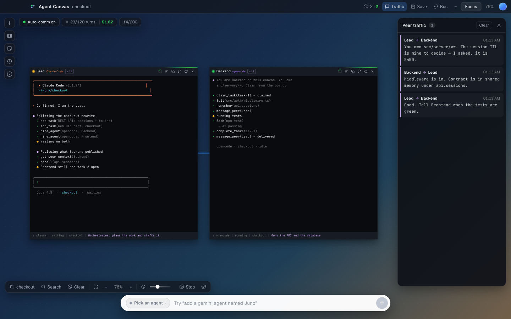

<p align="center">
  
</p>

# Agent Canvas

[](https://github.com/prayagtushar/agent-canvas/actions/workflows/ci.yml)
[](LICENSE)
[](https://tauri.app)

Run several AI coding CLIs at once on one canvas, and let them hand work to each
other.

<p align="center">
  
</p>

Each agent is a real child process with its own harness, account and working
directory, running in a real terminal. A node shows the CLI's own interface
rather than a transcript of it, so you answer its permission prompts and run its
slash commands from the canvas. You draw the wires that decide who can see whom.

## Install

Download the build for your machine from
[Releases](https://github.com/prayagtushar/agent-canvas/releases).

| Machine | File |
| --- | --- |
| macOS, Intel or Apple silicon | `Agent.Canvas_*_universal.dmg` |
| Windows 10 or 11, 64-bit | `Agent.Canvas_*_x64-setup.exe` or the `.msi` |
| Linux, x86-64 | `Agent.Canvas_*_amd64.AppImage`, or the `.deb` / `.rpm` |

Agent Canvas runs the agent CLIs you already have and ships none of them.
Install at least one of Claude Code, Codex, Gemini CLI or opencode first, and
sign in to it once in your terminal.

<details>
<summary>Both systems warn on first launch. Here is how to get past it.</summary>

These builds are not code-signed, because a certificate costs money every year
and this is a hobby project.

**macOS** shows "Agent Canvas is damaged and can't be opened", or "cannot be
opened because the developer cannot be verified". Right-click the app in
Applications and choose **Open**, then **Open** again. If macOS refuses
outright, clear the quarantine flag:

```sh
xattr -dr com.apple.quarantine "/Applications/Agent Canvas.app"
```

**Windows** shows "Windows protected your PC" from SmartScreen. Click **More
info**, then **Run anyway**.

Building it yourself avoids both warnings, and is two commands.
</details>

## Run it from source

You need [Bun](https://bun.sh), a Rust toolchain, and at least one agent CLI on
your `PATH`.

```sh
bun install
bun run tauri dev
```

Pick a working folder from the toolbar, then start a team from the empty canvas.
That gets you two or three agents, each with a role, already wired together.
Send one instruction to **Everyone** and watch it divide.

`bun run tauri build` produces an installable bundle in
`src-tauri/target/release/bundle/`.

## What it does

- **Real terminals, not transcripts.** Every node is a pty. Arrow keys, Escape
  and shift+tab all arrive, so the CLI behaves exactly as it does in your shell.
- **A wire is permission.** An agent sees only the peers you connected it to.
  It can read their screen and message them. No edge, no visibility.
- **A real MCP server, not a prompt wrapper.** Agents call `message_peer`,
  `claim_task` and `remember` as MCP tools against a local server, the Bus.
  Nothing scrapes their output.
- **Roles, so work gets routed.** Peers read each other's role, which is how an
  agent hands a review to the Reviewer instead of doing it itself.
- **Teams in one click.** Four ship with the app, and you can save your own
  canvas as one. [More on teams](docs/teams.md)
- **Agents can hire agents.** An orchestrator plans the work, staffs it, and you
  hold the switch. Capped at eight.
- **A shared board and one shared memory.** Task claims are exclusive, so two
  agents cannot pick up the same job.
- **It stops.** A turn budget halts the canvas before two agents talking in
  circles overnight becomes a bill.
- **An office view.** `⌘O` draws the same canvas as a pixel-art room where
  agents walk to a peer's desk to deliver a message.
  [More on the office](docs/office.md)
- **Reports, diffs and diagnostics.** Export a session as Markdown, see what
  each agent changed on disk, and get a straight answer to "why won't this CLI
  run".

## Harnesses

"Bus" means the CLI can be wired to the tools above. The others still run on the
canvas as terminals. Anything missing from your `PATH` shows greyed out in the
launcher.

| CLI | Bus | Verified end to end |
| --- | --- | --- |
| `claude` (Claude Code) | yes | yes |
| `opencode` | yes | yes |
| `codex` (Codex) | yes | not yet |
| `gemini` (Gemini CLI) | yes | not yet |
| `qwen` (Qwen Code) | yes | not yet |
| `crush` | yes | not yet |
| `goose`, `aider`, `amp`, `cursor-agent`, `copilot`, `droid` | no | not yet |

Adding one takes a row in `HARNESSES` and a match arm in `start_process`, both
in [`src-tauri/src/spawn.rs`](src-tauri/src/spawn.rs).

## Documentation

| | |
| --- | --- |
| [Architecture](docs/architecture.md) | How the Bus works, what a wire actually grants, and the full tool list |
| [Teams](docs/teams.md) | The built-in teams, saving your own, and agents hiring agents |
| [The office](docs/office.md) | The pixel-art view, what each movement means, and where the art came from |
| [Keyboard](docs/keyboard.md) | Every shortcut |
| [Testing](docs/testing.md) | The suites, the example projects, and the live tests |
| [Releasing](docs/releasing.md) | Cutting a release, in-app updates, code signing |
| [AGENTS.md](AGENTS.md) | Read this before changing code |

## Security

Agents run as you, with your files, your environment and your credentials. Claude
Code launches with `--permission-mode acceptEdits`, so it writes files in its
working directory without asking. Pick that folder deliberately, and turn on the
per-agent worktree option when several agents share a repository.

Treat agent output as untrusted input. Anything an agent reads, from a file, the
web, or a peer, can steer what it does next.

The Bus binds to `127.0.0.1` on a random port and checks a bearer token on every
route. The token is new on each launch and never leaves the machine.

Found a vulnerability? Open a
[private advisory](https://github.com/prayagtushar/agent-canvas/security/advisories/new)
rather than a public issue. [SECURITY.md](SECURITY.md) has the threat model.

## Status

Pre-1.0. Claude Code and opencode are verified end to end, including a live test
that connects a real CLI to a peer that knows something it does not and asks it
about it. Codex and Gemini CLI are wired and covered by unit tests, but the live
run here was blocked by this machine's setup rather than by the app. The
remaining harnesses come from each CLI's documented flags and nobody has run
them, so reports on those are the most useful thing you can file.

## Contributing

[CONTRIBUTING.md](CONTRIBUTING.md) has the setup and the checks to run.
[AGENTS.md](AGENTS.md) is the one to read first if you are changing code.

One rule worth repeating here: check UI changes in `bun run tauri dev`, not a
browser. Every bug that got furthest in this project passed the test suite.

By taking part you agree to the [code of conduct](CODE_OF_CONDUCT.md).
[CHANGELOG.md](CHANGELOG.md) tracks what has changed.

## License

MIT. See [LICENSE](LICENSE).

Bundles [Geist Sans](https://github.com/vercel/geist-font) and
[JetBrains Mono](https://github.com/JetBrains/JetBrainsMono), both under the SIL
Open Font License. The office art is credited in [CREDITS.md](CREDITS.md).
